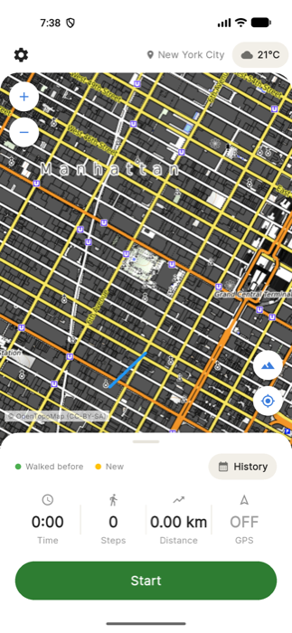
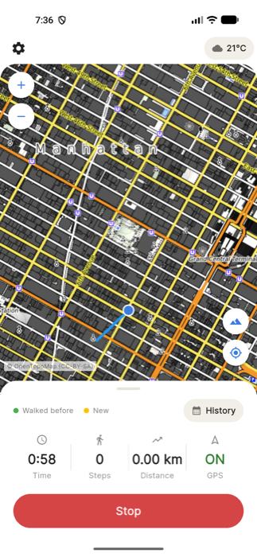
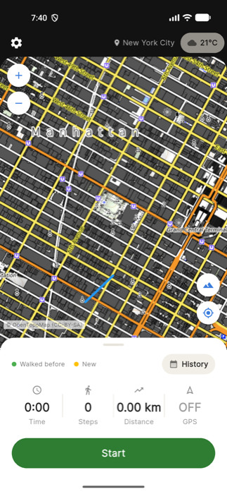
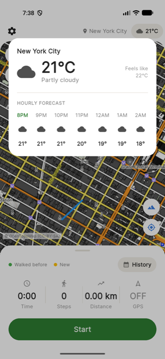
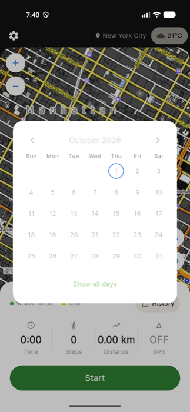

# Oway

A Flutter hiking/walking tracker for Android that reveals the world as you
explore it — every street you walk gets remembered, so your map fills in
over time like a personal fog-of-war of real places you've actually been.

<p align="center">
  
  
  
  
</p>

## Features

- **Explored-area tracking** — every GPS point you walk becomes a node
  covering a 10m circle of explored ground. Walk somewhere outside every
  saved circle and that stretch shows gold ("New"); walk back inside one
  (later in the same walk, or on a future walk) and it shows green
  ("Walked before"). Classification uses real geographic distance, ignores
  low-accuracy fixes, needs two consecutive readings to change colour, and
  holds back sudden GPS jumps until the next fix confirms them.
- **Live GPS tracking** — start/stop a walk and watch your route draw
  itself on the map in real time, color-coded new vs. already-explored as
  you move.
- **Background tracking** — tracking keeps running (with a persistent
  notification) even if you lock the screen or switch apps, powered by a
  native Android foreground service.
- **Real step counting** — steps come from the phone's actual hardware
  step-counter sensor (the same one native pedometer apps use), not a GPS
  distance estimate.
- **Haptic feedback** — the phone vibrates directly (bypassing any "touch
  feedback" system toggle) on Start, Stop, and whenever you cross into new
  territory.
- **Live weather + location** — the Home header always shows your current
  location name and live weather, refreshed from a fresh GPS fix every
  time. Tap it for an Apple Weather–style detail popup with an hourly
  forecast.
- **History calendar** — browse past walks by date on a calendar, or view
  them all at once.
- **Walk summary & weekly chart** — after each walk, see time, steps,
  distance, and newly explored area, plus a 7-day distance bar chart.
- **Dark mode** — a full dark theme, toggled from Settings and persisted
  across launches.

## Screenshots

| Home (light) | Home (dark) | Weather detail |
|---|---|---|
|  |  |  |

| Live tracking | History calendar | Settings |
|---|---|---|
|  |  |  |

## Tech stack

- **Flutter** (Material 3) for the UI
- [`flutter_map`](https://pub.dev/packages/flutter_map) with OpenTopoMap tiles
- [`geolocator`](https://pub.dev/packages/geolocator) for GPS
- [`pedometer`](https://pub.dev/packages/pedometer) for real step counting
- [`vibration`](https://pub.dev/packages/vibration) for direct haptic feedback
- `sqflite` for local walk history storage
- A native Kotlin foreground `Service` + `MethodChannel` (not a Flutter
  background plugin) to keep GPS tracking alive reliably while
  backgrounded, without the multi-engine conflicts those plugins can cause
- [Open-Meteo](https://open-meteo.com/) and
  [BigDataCloud](https://www.bigdatacloud.com/) free APIs for weather and
  reverse geocoding (no API key required)

## Getting started

```bash
flutter pub get
flutter run
```

Requires a device/emulator with location services, and (for live weather
and map tiles) an internet connection.

## Walk simulation test

`tool/walk_sim/` replays a realistic 1.9 km walk (SR Comfort PG, Arekere →
Royal Meenakshi Mall, real OpenStreetMap route) into an Android emulator's
GPS: varying pace, GPS jitter, waiting at a signal, a U-turn, a side-street
detour, and a GPS spike.

```bash
# start a walk in the app on the emulator, then:
python3 tool/walk_sim/simulate_walk.py
# offline check of the green/gold logic, phase by phase:
cd tool/walk_sim && python3 check_classification.py
```
