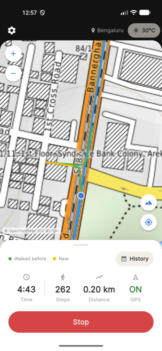
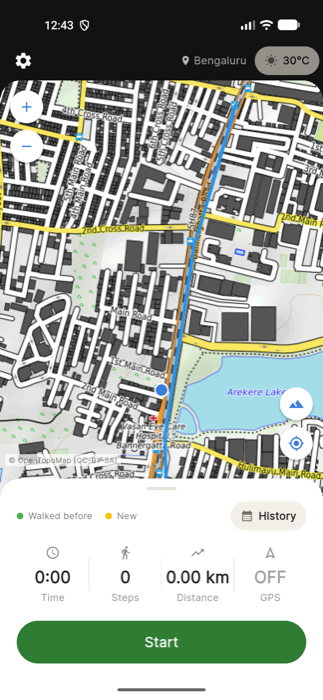
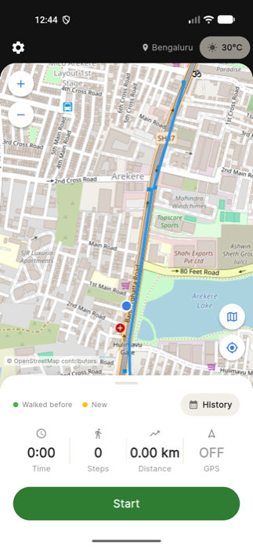
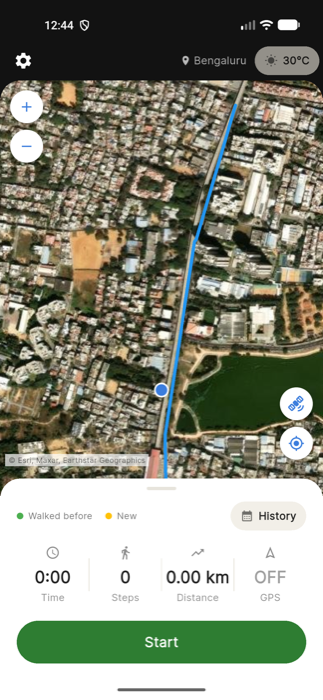
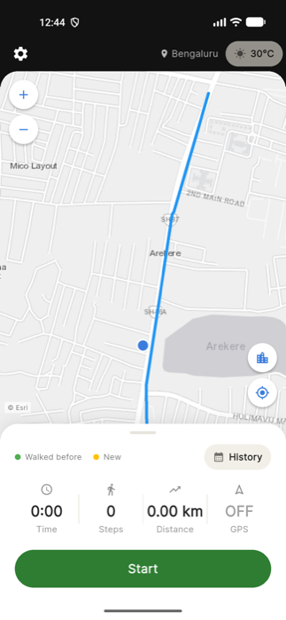
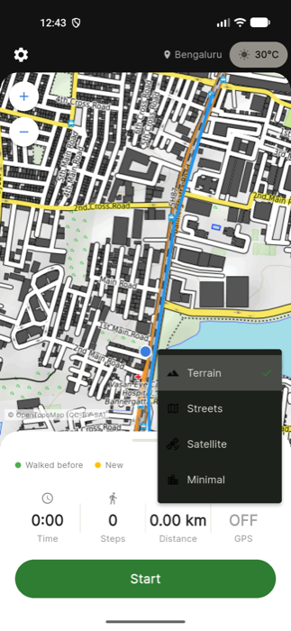
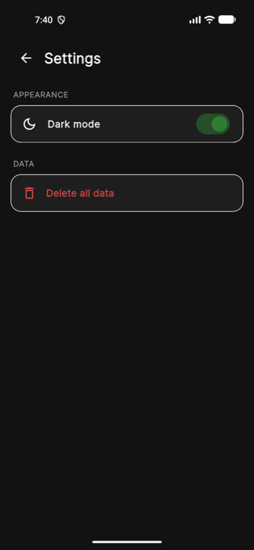

<p align="center">
  
</p>

<h1 align="center">Oway</h1>

<p align="center">
  A free Android app that remembers every street you've walked —<br/>
  <b>gold</b> for new paths, <b>green</b> for places you've already been.
</p>

<p align="center">
  <a href="https://github.com/vishnuroopeshc/Oway/releases/latest/download/Oway.apk"><b>⬇ Download the APK</b></a>
</p>

---

## Guys, you're probably wondering what Oway is

Let me explain how we came up with Oway.

My friends and I love roaming around — walking down random streets,
exploring new paths and new areas. But after a while it got hard to remember
things like: *which paths have we already explored? Have we ever been on
this street before?*

One day we said it would be really nice to have some kind of tracker that
remembers the paths we've explored. So we searched the Play Store and found
a few apps — but all of them were paid.

Then the thought came to us: why can't we build our own? We're engineers,
right? So we built Oway, for exactly our own purpose.

<p align="center">
  
  
  
  
</p>

## What the colours mean


| Colour | Meaning |
|---|---|
| 🟡 **Gold** | **New.** You've never walked here before. |
| 🟢 **Green** | **Walked before.** You've been here — on an earlier walk, or earlier in this same walk. |
| 🔵 **Blue** | A saved walk from your history, drawn on the map. |
| 🔵 **Blue dot** | Where you are right now. |

In the screenshot: the blue line is a walk we did earlier down Bannerghatta
Road. Walking that road again draws **green**, turning into a side street
we'd never been on draws **gold**, and walking back out of it draws
**green** again (on top of the gold).

The colour is decided continuously, piece by piece, so one walk can go
🟢🟢🟡🟡🟢🟢 as you move between familiar and new ground.

<br clear="right"/>

## How the GPS tracking works

**1. Getting a good first fix.** When you tap **Start**, the button shows
*Locating…* for a few seconds. Right after the GPS wakes up its first
readings are often off by tens of meters, so Oway collects readings for up
to 6 seconds and starts the walk from the first one accurate to within 15m
(or the best one it got).

**2. Every point you walk becomes a 10m circle.** Each GPS point on your
walk is saved as a *node*, and every node marks a circle of radius 10m
around it as explored. Long gaps between two readings are filled in with
extra nodes every 10m, so a fast GPS jump can't skip over ground you
actually walked.

**3. Green or gold?** For each new reading, Oway measures the real
distance on the ground (not just comparing latitude/longitude numbers, since
GPS never gives the exact same numbers twice) to the nearby saved nodes:

- inside any saved circle → **green**
- outside all of them → **gold**, and new nodes are saved for this stretch
  so it will be green next time

**4. Revisits within the same walk.** GPS readings arrive every few meters
— closer together than the 10m circle — so a node you placed one step ago
would instantly make your next step green. To avoid that, a node from the
*current* walk only starts counting once you've moved more than **20m
away** from it. Walk away and come back → green. Keep going forward on a
new street → stays gold. Standing still at a signal also stays gold, because
GPS wobble never takes you 20m away.

**5. Ignoring bad GPS readings.**
- Readings the phone itself reports as worse than 25m accurate are ignored
  for colouring (they still count for distance).
- The colour only changes after **two readings in a row** agree, so one
  noisy reading right at the edge of a circle can't flip it.
- A sudden jump of more than 30m is held back for one reading: if the next
  reading carries on from it, it was real movement and it's kept; if the
  next reading snaps back to where you were, it was a GPS spike and it's
  thrown away.

**6. Keeps tracking with the screen off.** While a walk is running, a small
native Android foreground service keeps it alive (with a notification
showing time, steps and distance), so locking the phone or switching apps
doesn't stop the walk.

## How a walk is measured

| Stat | How it's measured |
|---|---|
| **Time** | A timer from the moment the walk starts. |
| **Distance** | The sum of the real ground distance between consecutive GPS points. |
| **Steps** | From your phone's built-in step-counter sensor — the same one fitness apps use — so it counts actual steps from your phone's movement. If a phone has no step sensor (or the permission is denied), steps are estimated as distance ÷ 0.75m. |
| **New area** | The distance you walked on gold (never-explored) ground. |

When you stop, you get a **Walk complete** summary: the route on a map,
the new area discovered, your stats, this walk vs. your average, and a bar
chart of the last 7 days. Every walk is saved on the phone, and the
**History** button opens a calendar to look back at any day.

The phone also vibrates on **Start**, on **Stop**, and whenever you step
into new territory.

## Map styles

Tap the map-style button (bottom right of the map) to switch between four
maps. Your routes and colours stay the same on all of them.

| Terrain | Streets | Satellite | Minimal |
|---|---|---|---|
|  |  |  |  |
| Contour lines and footpaths, good for hikes ([OpenTopoMap](https://opentopomap.org)) | Regular street map with shops and landmarks ([OpenStreetMap](https://www.openstreetmap.org)) | Real aerial photos (Esri World Imagery) | Plain light-grey map so your routes stand out (Esri) |



## Other features

| Weather | History | Settings |
|---|---|---|
|  |  |  |
| Your current location name and live weather at the top; tap it for an hourly forecast. | Pick a day to see only that day's walks. | Dark mode, and an option to delete all your data. |

## Install on your phone

1. On your Android phone, open
   **[Download Oway.apk](https://github.com/vishnuroopeshc/Oway/releases/latest/download/Oway.apk)**.
2. Open the downloaded file. If Android asks, allow your browser / file
   manager to **install unknown apps**.
3. Tap **Install**, then open **Oway**.
4. Allow **Location** (for tracking), **Notifications** (to keep tracking
   with the screen off) and **Physical activity** (for the step counter).

Your walks are stored only on your phone. Oway is Android-only for now.

## Build it yourself

```bash
git clone https://github.com/vishnuroopeshc/Oway.git
cd Oway
flutter pub get
flutter run                  # run on a connected phone / emulator
flutter build apk --release  # build build/app/outputs/flutter-apk/app-release.apk
```

## Walk simulation test

`tool/walk_sim/` replays a realistic 1.9 km walk — from SR Comfort PG,
Arekere to Royal Meenakshi Mall, on the real OpenStreetMap route — into an
Android emulator's GPS, with changing pace, GPS wobble, waiting at a
signal, a U-turn, a side-street detour and a fake GPS spike.

```bash
# start a walk in the app on the emulator, then:
python3 tool/walk_sim/simulate_walk.py
# check the green/gold logic offline, phase by phase:
cd tool/walk_sim && python3 check_classification.py
```

## Built with

- **Flutter** (Material 3)
- [`flutter_map`](https://pub.dev/packages/flutter_map) for the maps
- [`geolocator`](https://pub.dev/packages/geolocator) for GPS
- [`pedometer`](https://pub.dev/packages/pedometer) for the step counter
- [`vibration`](https://pub.dev/packages/vibration) for haptics
- `sqflite` to store walks on the phone
- A native Kotlin foreground service for background tracking
- [Open-Meteo](https://open-meteo.com/) and
  [BigDataCloud](https://www.bigdatacloud.com/) for weather and location
  names (free, no API key)
